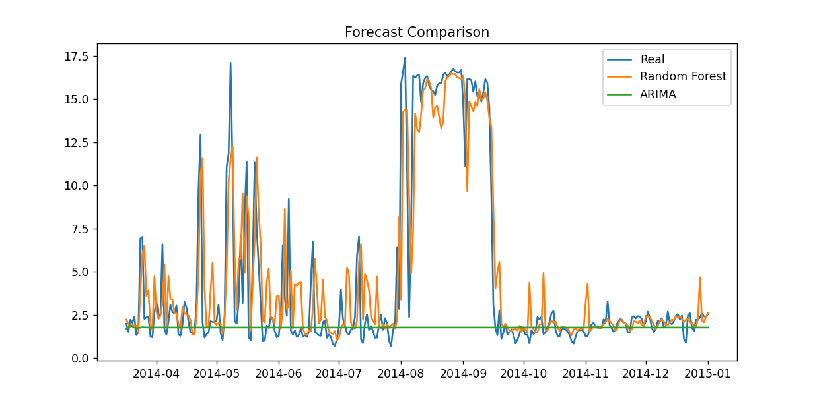

# ⚡ Demand Forecasting with Machine Learning

<p align="center">
  
  
  
</p>

---

## 📌 Overview

This project focuses on **forecasting electricity demand** using real-world consumption data.

It compares:

* 🔹 A machine learning model (**Random Forest**)
* 🔹 A classical statistical model (**ARIMA**)

The goal is to evaluate performance in a **highly volatile and non-linear time series environment**.

> ⚠️ Dataset not included due to size (~600MB). See Dataset section below.

---

## 🚀 Project Highlights

* Real-world dataset (energy consumption)
* End-to-end machine learning pipeline
* Model comparison: ML vs statistical methods
* ~58% improvement in MAE using Random Forest

---

## 📂 Dataset

Dataset: **Electricity Load Diagrams (2011–2014)**

---

### ⬇️ Download

* https://archive.ics.uci.edu/ml/datasets/ElectricityLoadDiagrams20112014
* https://www.kaggle.com/datasets/michaelrlooney/electricity-load-diagrams-2011-2014

---

### 📁 Setup

Place the dataset here:

```bash
data/LD2011_2014.txt
```

Expected structure:

```bash
project/
├── data/
│   └── LD2011_2014.txt
├── src/
├── main.py
```

---

## ⚡ Quick Start

```bash
git clone https://github.com/jpomanrique/DataScience.git
cd DataScience/demand-forecasting-ml
pip install -r requirements.txt
python main.py
```

---

## ⚙️ Methodology

### 🔹 Data Processing

* Datetime conversion
* Numeric normalization
* Daily aggregation
* Missing value handling

### 🔹 Feature Engineering

* Lag features (1, 7 days)
* Rolling averages
* Time-based features

### 🔹 Models

* Random Forest Regressor
* ARIMA (baseline)

### 🔹 Evaluation Metrics

* MAE (Mean Absolute Error)
* RMSE (Root Mean Squared Error)

---

## 📊 Results

| Model         | MAE  | RMSE |
| ------------- | ---- | ---- |
| Random Forest | 1.37 | 2.24 |
| ARIMA         | 3.23 | 5.39 |

> Random Forest significantly outperformed ARIMA, reducing MAE by approximately 58%, demonstrating its ability to capture non-linear patterns in the data.

---

## 📉 Model Comparison

<p align="center">
  
</p>

---

## 📈 Key Insights

* Strong **non-linear patterns** in the dataset
* ARIMA shows clear **underfitting**
* Random Forest captures trends and variability more effectively
* Feature engineering was critical for performance

---

## 🚀 Business Relevance

Accurate demand forecasting enables:

* ⚡ Energy optimization
* 💰 Cost reduction
* 📊 Better planning and resource allocation

---

## ▶️ How to Run

```bash
pip install -r requirements.txt
python main.py
```

---

## 🧠 Future Improvements

* XGBoost / LightGBM
* Hyperparameter tuning
* Longer temporal features (14, 30 days)
* Deployment with Streamlit

---

## 👤 Author

**John Peter Oyardo Manrique**
📧 [jpomanrique@gmail.com](mailto:jpomanrique@gmail.com)

🔗 Connect on LinkedIn

---

## ⭐ If you found this useful, consider starring the repository!

